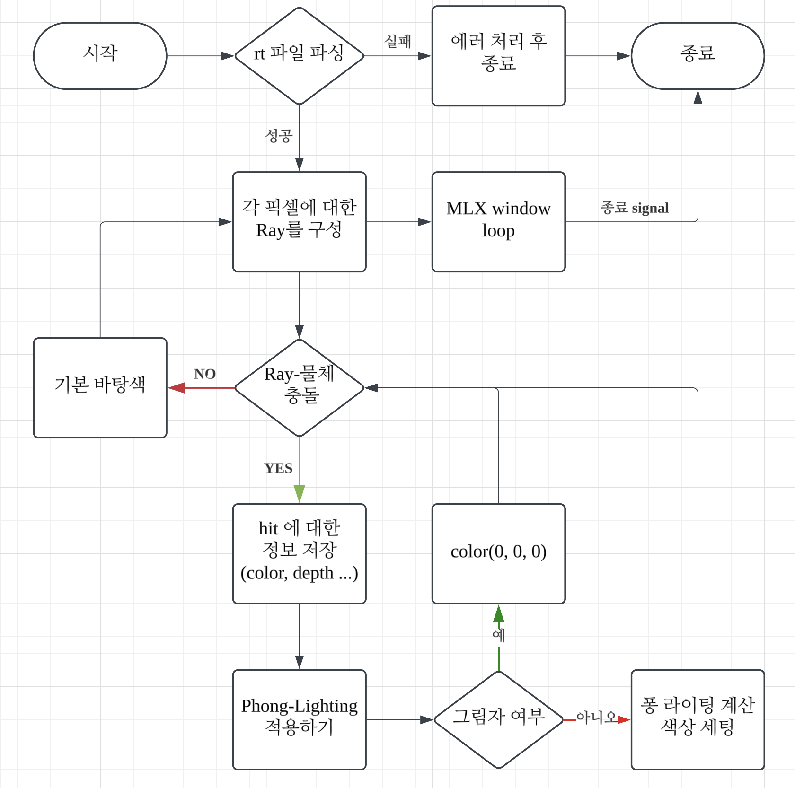

# miniRT
my own mini Raytracing.
Team project with seonyoon.

---

## 프로젝트 소개
- 42 graphics API인 MLX를 활용하여 간단한 레이트레이싱 기법들을 구현해보기
- rt파일을 읽고 그에 맞게 물체들을 그려내는 프로그램을 설계하기.
- 라이팅 기법에 대해 공부해보고, 적용해보기.

### 팀 구성
`seonyoon` : miniRT parsing 및 입출력 처리

`sihkang`  : 렌더링 파트 구현

---
## 구현 사항
- 평면, 구, 원통 도형에 대한 렌더링 구현
- 퐁 모델 구현을 통한 라이팅 적용
- 그림자 생성 적용

## 실행 방법
- `make` 실행
- `./miniRT [실행할파일.rt]` 입력

### plain1.rt
무한 평면에 대한 적용

### plains_sphere.rt

### sphere1.rt

### temple.rt

---
## simple flowChart

